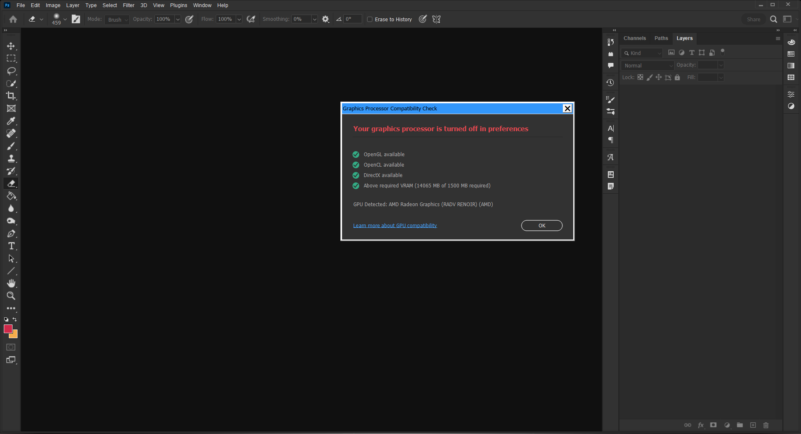

# Winetricks configuration for Adobe Photoshop CC on Linux


# Description
This script sets up a WINE prefix that can be used to install and run some modern versions of Adobe Photoshop.  
It has been tested with CC 2022 (v23).  
**This script is heavily work in project, and the final Photoshop installation might not be ready for usage in production (see Known issues).**  
The installer doesn't download Adobe Photoshop or plugins for you. Once a prefix is prepared, you can use it to install Photoshop by yourself.

# Requirements
- An internet connection
- All **read** and **write** rights on your home folder and the folder of installation
- `wine` >=8.0 (>=9.0 recommended)
- `tar`
- `wget`
- `curl`

## Optional
- Vulkan capable GPU or APU
- Latest graphics drivers for your GPU, including:
    - OpenGL
    - OpenCL
- `dxvk` - drastically sped up PS launch time on my device
- `winetricks winbind`, `samba` - for [NTLM](https://en.wikipedia.org/wiki/NTLM)
- `lib32-gnutls` - together with winbind and samba might be required for licensing or adobe cloud

# Using the script

You can clone the repo or just download the installer.sh file. After that:

```bash
# Make it executable
chmod +x installer.sh

# Run it:
./installer.sh
```
Go through the installation and then agree to the several popups with ToS for some Microsoft packages. These are required to run Photoshop.
# Set up steps after using the script
Make note of the path to the prefix directory that you created with the script. WINEPREFIX= requires an **absolute path**, for example, `/home/user/photoshop/` instead of `~/photoshop`.
## For Photoshop 2022 (v23)
Use the original installer (.exe). Replace "/path/to/prefix" with created directory and "filename.exe" with the installer's name.
```bash
WINEPREFIX=/path/to/prefix wine "filename.exe"
```
For example:
```bash
WINEPREFIX=/home/user/Photoshop wine "Adobe Photoshop 2022.exe"
```
# Starting Photoshop

After you run the installer, open your application menu, and search for "Photoshop", and click on it. As simple as that!

If everything is installed correctly, in Help > GPU Compatibility you should see something like this:




# Known issues 
- Having GPU support enabled currently prevents PS (2022 and newer) from being able to properly open a new or an existing document. It seems like Wine 9.0 at least prevents PS from always crashing, and you can kinda see the document now, so maybe we're getting closer to proper GPU support. 
    - Go to Preferences > Performance > uncheck "Use Graphics Processor"
    - Consider checking "Multithreaded composing" to compensate for the lost performance
- Using the app maximised might cause it to flicker often whenever anything gets re-rendered (including on zooming in-out, opening a new child window, etc.) 
    - To avoid, resize the window to your taste without clicking the maximise button
- "Use Tooltips" setting reportedly prevents plugins from being used
    - Go to Preferences > Tools > uncheck "Use Tooltips"
- Enabling Wine's Virtual Desktop will prevent child windows from becoming visible
- (On KDE Plasma) Does not respect panels, some elements of the interface could end up hidden behind a panel
    - You can resize the app manually by right-clicking on PS on the toolbar > More > Resize
## No workarounds
- GPU-only features don't work
- Remains frozen the first ~5 seconds after opening
# Untested features
- Licensing
- Camera Raw
- Plugins


# Credits

+ [MiMillieuh](https://github.com/MiMillieuh) for finding the components that make Photoshop run using `wine`.
+ [YoungFellow-le](https://github.com/YoungFellow-le) for his work on the original version of this installer for Photoshop CC 2021 (v22)
